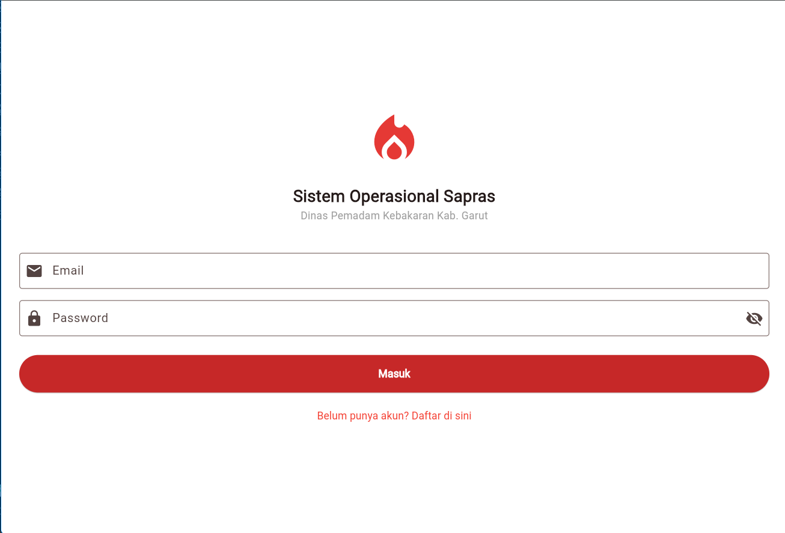
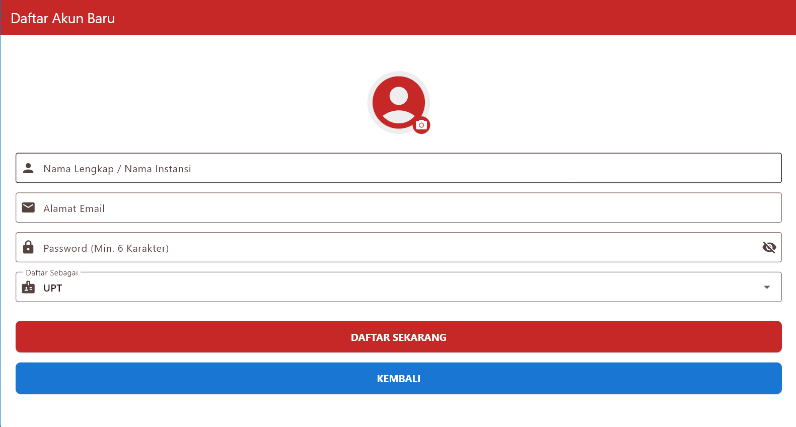
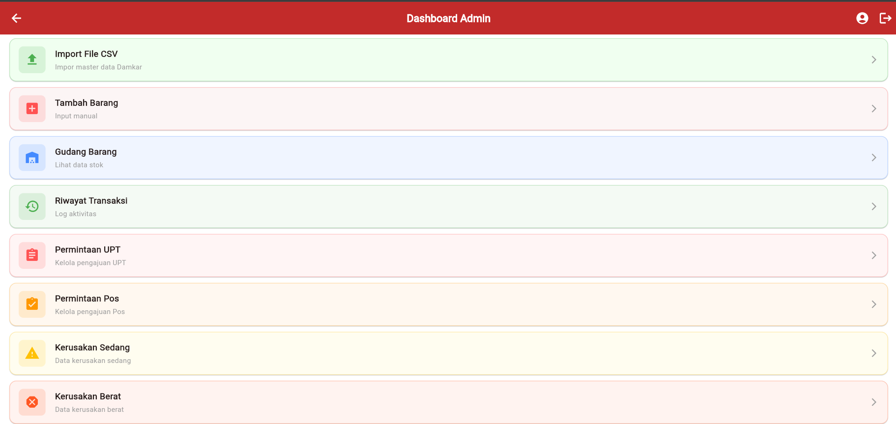
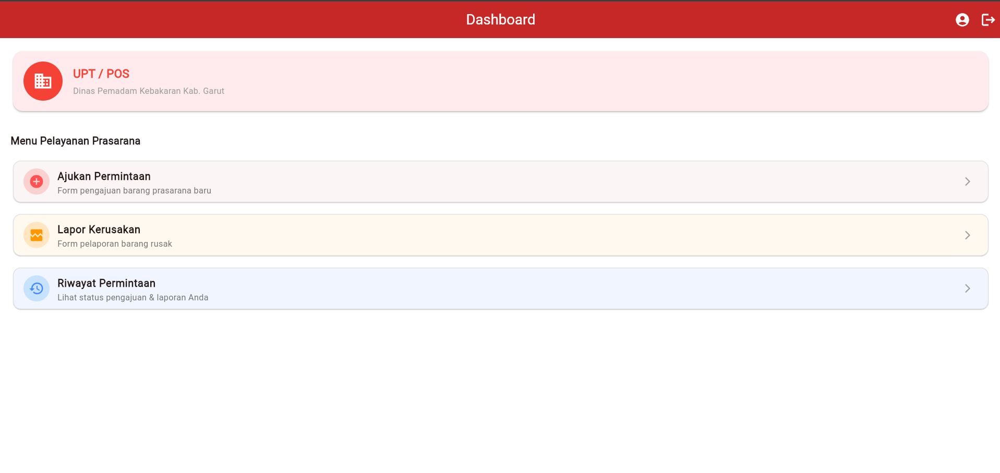
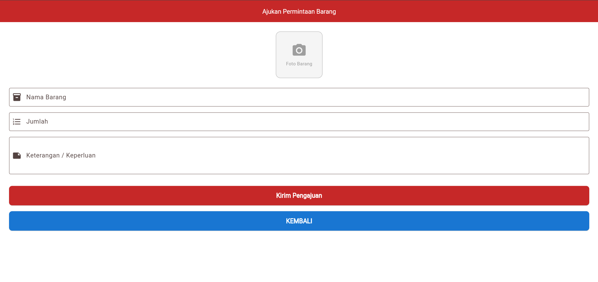
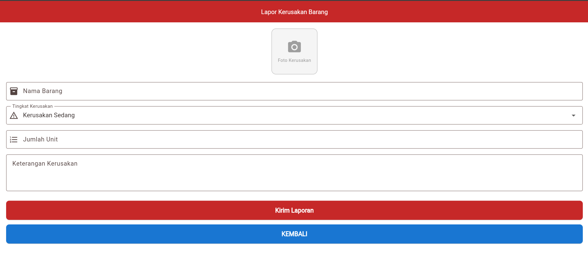

# SIMA Damkar 🚒
**Dinas Pemadam Kebakaran Kabupaten Garut**

Sebuah aplikasi berbasis *mobile* (Android/iOS) yang dibangun menggunakan kerangka kerja Flutter. Aplikasi ini dirancang khusus untuk mendigitalisasi dan mempermudah proses pelaporan kerusakan barang serta pengajuan permintaan sarana dan prasarana antara Pos Pemadam, Unit Pelaksana Teknis (UPT), dan Admin Pusat.

---

## 📋 Daftar Isi
1. [Pengenalan & Latar Belakang Sistem](#-pengenalan--latar-belakang-sistem)
2. [Fitur Utama Aplikasi](#-fitur-utama-aplikasi)
3. [Tampilan Aplikasi & Navigasi](#-tampilan-aplikasi--navigasi)
4. [Struktur File Layar (Screens)](#-struktur-file-layar-screens)
5. [Teknologi yang Digunakan](#-teknologi-yang-digunakan)
6. [Tata Cara Pembuatan Aplikasi](#-tata-cara-pembuatan-aplikasi)
7. [Daftar Bug & Cara Menyelesaikannya](#-daftar-bug--cara-menyelesaikannya)
8. [Panduan Build & Instalasi di HP (Android)](#-panduan-build--instalasi-di-hp-android)

---
## 📖 Pengenalan & Latar Belakang Sistem

Dinas Pemadam Kebakaran Kabupaten Garut merupakan lembaga pelayanan publik garda terdepan yang memegang tanggung jawab krusial dalam penanggulangan bahaya kebakaran, penyelamatan (*rescue*), serta mitigasi bencana di wilayah administratif Kabupaten Garut yang luas. Dalam menjalankan tugas operasional sehari-hari, kesiapan dan ketersediaan sarana dan prasarana (Sapras)—mulai dari unit kendaraan operasional, selang pemadam tekanan tinggi, alat pelindung diri (APD), hingga peralatan evakuasi teknis—merupakan faktor penentu utama dalam kecepatan dan keberhasilan respons di lapangan.

Namun, dalam praktiknya, pengelolaan inventaris dan pelaporan kerusakan fasilitas di pos-pos sektor maupun Unit Pelaksana Teknis (UPT) di bawah naungan Dinas Pemadam Kebakaran Kabupaten Garut masih menghadapi berbagai kendala struktural. Beberapa permasalahan utama yang sering dijumpai meliputi:

1. **Proses Pelaporan yang Konvensional:** Pengiriman informasi kerusakan alat atau pengajuan logistik dari pos cabang ke kantor pusat umumnya masih menggunakan metode manual (seperti pesan singkat atau rekapitulasi kertas). Hal ini berisiko tinggi menyebabkan informasi terlambat sampai, tercecer, atau kurang akurat.
2. **Keterlambatan Rekapitulasi Data Inventaris:** Admin pusat seringkali kesulitan untuk memantau kondisi riil inventaris di setiap pos secara *real-time*. Akibatnya, pengambilan keputusan terkait perbaikan atau pengadaan barang baru kerap mengalami penundaan.
3. **Risiko Kesalahan Pencatatan (Human Error):** Pengelolaan stok gudang yang belum terdigitalisasi dengan baik meningkatkan potensi selisih data antara fisik barang di gudang dengan catatan pembukuan administratif.
4. **Kurangnya Transparansi Status Pengajuan:** Petugas di pos atau UPT sering kali harus menunggu tanpa kejelasan terkait status tindak lanjut dari laporan kerusakan yang telah mereka kirimkan, apakah sedang ditinjau, disetujui, atau ditolak oleh pihak pusat.

Berdasarkan berbagai permasalahan tersebut, transformasi digital melalui penerapan sistem informasi berbasis perangkat bergerak (*mobile application*) menjadi suatu kebutuhan yang mendesak (*urgent*). 

Untuk menjawab tantangan ini, dikembangkanlah **SIMA DAmkar (Sistem Informasi Manajemen Sarana dan Prasarana Dinas Pemadam Kebakaran)**. Aplikasi ini dirancang sebagai platform terpadu yang menjembatani komunikasi operasional antara petugas lapangan (Pos dan UPT) dengan manajemen pusat (Admin). Dengan memanfaatkan teknologi *cross-platform* Flutter dan arsitektur *cloud database* berbasis *real-time* (Firebase Cloud Firestore), SIMA DAmkar mampu mendigitalisasi seluruh siklus hidup pelaporan—mulai dari pengiriman laporan kerusakan berlampirkan bukti foto, validasi tingkat keparahan (Ringan, Sedang, Berat), hingga pemotongan stok gudang pusat secara otomatis saat pengajuan disetujui.

Kehadiran sistem ini diharapkan mampu meningkatkan efisiensi birokrasi internal, meminimalisir kesalahan pencatatan logistik, mempercepat waktu tanggap (*response time*) pemeliharaan sarana, serta mewujudkan tata kelola inventaris yang transparan dan akuntabel di lingkungan Dinas Pemadam Kebakaran Kabupaten Garut.

---
## 🚀 Fitur Utama Aplikasi
* **Autentikasi Multi-Peran yang Aman:** Menggunakan Firebase Authentication yang terintegrasi langsung dengan penyimpanan data pengguna di Firestore, lengkap dengan dukungan fitur *Autofill* dan *Password Manager* bawaan perangkat untuk kemudahan masuk.
* **Pelaporan & Pengajuan Real-time:** Memungkinkan petugas lapangan mengirimkan formulir laporan kerusakan atau permintaan barang baru dengan menyertakan bukti visual berupa foto.
* **Manajemen Gambar Hibrida (Base64 & URL):** Sistem secara cerdas mampu membaca dan merender data gambar baik yang bersumber dari URL Internet maupun string terkompresi berformat *Base64*.
* **Pengurangan Stok Otomatis:** Ketika Admin menyetujui suatu pengajuan permintaan barang dari pos, sistem secara otomatis menghitung dan memotong jumlah ketersediaan stok di basis data gudang pusat (`gudang_barang`).
* **Sistem Pelacakan Status & Riwayat:** Setiap laporan memiliki siklus hidup yang transparan, mulai dari status *Menunggu*, hingga berubah menjadi *Disetujui* atau *Ditolak*, yang kemudian diarsipkan secara otomatis ke dalam menu Riwayat pengguna.
* **Fitur Zoom Interaktif:** Dilengkapi dengan komponen *InteractiveViewer* pada dialog gambar agar pengguna dapat memperbesar foto bukti kerusakan untuk pemeriksaan yang lebih detail.

---

## 📸 Tampilan Aplikasi & Navigasi
*(Letakkan file gambar UI pada folder `assets/images/` di dalam proyek, lalu sesuaikan nama filenya di bawah ini)*

### 1. Autentikasi
 


### 2. Dashboard Berdasarkan Role



### 3. Form Pengajuan & Laporan



---

## 📂 Struktur File Layar (Screens)
Aplikasi ini dikembangkan dengan memisahkan logika UI ke dalam beberapa file utama yang berfokus pada fungsionalitas masing-masing:
* `login_screen.dart`: Halaman masuk dengan fitur *AutofillGroup* untuk integrasi ke *Password Manager* HP.
* `admin_dashboard_screen.dart` / `upt_dashboard_screen.dart`: Pusat kendali navigasi berdasarkan peran pengguna.
* `kerusakan_sedang_screen.dart` / `kerusakan_berat_screen.dart`: Layar admin untuk memonitor laporan kerusakan spesifik.
* `permintaan_pos_screen.dart` / `permintaan_upt_screen.dart`: Layar admin untuk meninjau pengajuan barang baru dari cabang.
* `riwayat_permintaan_screen.dart`: Layar histori status untuk melihat laporan yang telah disetujui atau ditolak.

---

## 🛠 Teknologi yang Digunakan
* **Framework:** [Flutter](https://flutter.dev/) (Dart)
* **Backend & Database:** Firebase Cloud Firestore
* **Autentikasi:** Firebase Authentication
* **Penyimpanan Lokal:** Shared Preferences
* **Format Tanggal:** package `intl`

---

## 📝 Tata Cara Pembuatan Aplikasi (Dari Awal - Akhir)

Pengembangan aplikasi ini dilakukan melalui tahapan sistematis dari nol hingga tahap *deployment*:

### Tahap 1: Inisiasi Proyek & Desain UI
1. Membuat proyek Flutter baru menggunakan perintah terminal `flutter create sima_damkar`.
2. Merancang kerangka UI (*User Interface*) untuk halaman statis menggunakan komponen Material Design Flutter.
3. Membagi sistem navigasi berdasarkan peran (*Role-Based Navigation*).

### Tahap 2: Konfigurasi Firebase & Backend
1. Mendaftarkan proyek baru di Firebase Console.
2. Mengaktifkan layanan **Authentication** (metode Email/Password) dan **Firestore Database** untuk penyimpanan data mentah (NoSQL).
3. Menghubungkan aplikasi Flutter dengan Firebase menggunakan utilitas Firebase CLI (`flutterfire configure`).
4. Menambahkan *package* pendukung ke dalam file `pubspec.yaml`.

### Tahap 3: Pembuatan Logika Autentikasi & Sesi
1. Mendaftarkan fungsi *Register* yang menyimpan kredensial di Auth dan menyimpan *Role* (Admin/UPT/Pos) ke dalam dokumen *User* di Firestore.
2. Membangun fungsi Login yang menyeleksi dokumen Firestore setelah autentikasi berhasil, lalu melempar pengguna ke Dashboard yang sesuai jabatannya.
3. Mengonfigurasi `AutofillGroup` agar sistem membaca fitur *Google Password Manager* saat pengguna mengetik kredensial login.

### Tahap 4: Implementasi Fitur Utama (CRUD)
1. **Create:** Mengunggah form teks beserta gambar. Gambar difoto, dikompres, dikonversi ke format *String Base64*, dan didorong ke koleksi `laporan_kerusakan`.
2. **Read:** Memanfaatkan `StreamBuilder` untuk menarik data masuk ke antarmuka secara *real-time* tanpa perlu di-*refresh*.
3. **Update:** Membuat fungsi asinkron (Setujui/Tolak). Jika tombol disetujui ditekan, sistem otomatis mencari *id* barang di `gudang_barang` dan mengkalkulasi pengurangan stok.
4. **Delete/History:** Memfilter *query* data Firestore berdasarkan parameter status (`Menunggu` vs `Disetujui/Ditolak`) agar data mengalir ke halaman Riwayat.

### Tahap 5: Standarisasi Tampilan Komponen
1. Menyeragamkan logika *Card* pelaporan di semua antarmuka (Kerusakan & Permintaan) agar proporsional di berbagai ukuran HP.
2. Menerapkan fungsi pembacaan gambar hibrida (`_buildImageWidget`) yang bisa otomatis merender tipe URL Internet maupun Teks Base64, dan tahan terhadap *error* ketika *string* data terputus.

---

## 🐛 Daftar Bug & Cara Menyelesaikannya

Selama proses pengerjaan aplikasi, terdapat beberapa kendala teknis yang berhasil dipecahkan:

1. **Bug: Tampilan Kartu (Card) Laporan Terlalu Besar**
   * **Penyebab:** Tinggi gambar (preview foto bukti) di-set statis `180` piksel, membuat layar HP cepat penuh dan UI berantakan.
   * **Solusi:** Memperkecil tinggi *frame* gambar menjadi `100` piksel, menyembunyikan kontainer yang kosong (`SizedBox.shrink()`), dan menambahkan `InteractiveViewer` pada *Dialog Pop-up* agar gambar dapat diklik (zoom) untuk melihat detail tanpa merusak tata letak *list*.

2. **Bug: Gambar Base64 Tidak Muncul (Invalid Length)**
   * **Penyebab:** Teks string Base64 dari *database* Firestore sering memiliki spasi siluman, imbuhan *metadata* (`data:image/jpeg;base64,`), atau kehilangan karakter validasi (`=`) di akhir teks.
   * **Solusi:** Menulis rutin *Data Cleaning* pada kode sebelum fungsi `base64Decode` dijalankan. Yaitu menghapus prefix `.split(',').last`, membuang spasi `.replaceAll(RegExp(r'\s+'), '')`, dan mengkalkulasi modulo 4 untuk menambah karakter `=` yang hilang.

3. **Bug: Pop-up "Simpan Sandi" (Autofill) Tidak Muncul di Halaman Login**
   * **Penyebab:** *TextField* standar Flutter tidak memiliki *bridge* otomatis ke layanan *Password Manager* OS Android/iOS.
   * **Solusi:** Membungkus *TextField* dengan `AutofillGroup`, mengisi `autofillHints: [AutofillHints.email, AutofillHints.password]`, dan secara eksplisit memanggil `TextInput.finishAutofillContext()` segera setelah aksi *login* divalidasi.*  
---

## 📱 Panduan Build & Instalasi di HP (Android)

Langkah-langkah berikut digunakan untuk mengemas kode sumber (*Source Code*) menjadi aplikasi matang siap pakai (.APK) dan memasangnya di *smartphone*.

### A. Persiapan Lingkungan (*Environment*)
1. Pastikan Anda telah menginstal **Flutter SDK** beserta perkakas pengembangan Android.
2. Buka Terminal / CMD di dalam direktori proyek SIMA DAmkar, lalu periksa kesehatan sistem dengan perintah:
   ```bash
   flutter doctor
   ```
3. Unduh dan perbarui semua dependensi pihak ketiga (*packages*) yang dideklarasikan di `pubspec.yaml`:
   ```bash
   flutter pub get
   ```

### B. Proses Kompilasi APK (Mode Release)
Metode ini menghasilkan file instalasi ringan dan cepat yang ditujukan untuk didistribusikan ke staf/pengguna akhir.

1. Bersihkan *cache* sisa *build* sebelumnya untuk mencegah galat konflik file:
   ```bash
   flutter clean
   flutter pub get
   ```
2. Mulai proses kompilasi kode menjadi APK *Release*:
   ```bash
   flutter build apk --release
   ```
3. Proses ini memakan waktu beberapa menit. Jika sukses, file `app-release.apk` akan digenerate secara otomatis pada rute direktori:
   `[Folder-Proyek]/build/app/outputs/flutter-apk/app-release.apk`

### C. Instalasi Aplikasi ke HP
1. Pindahkan file `app-release.apk` dari PC ke memori internal HP Android Anda (melalui Kabel Data, Google Drive, atau Bluetooth).
2. Melalui HP Anda, buka aplikasi pengelola berkas (*File Manager*), cari APK tersebut, lalu ketuk untuk memasang.
3. Jika dihadang oleh notifikasi privasi bawaan Android ("Instal aplikasi yang tidak dikenal"):
   * Pilih menu **Pengaturan (Settings)** pada dialog *pop-up*.
   * Geser *toggle* untuk mengaktifkan izin **"Izinkan dari sumber ini"**.
   * Kembali ke menu instalasi, dan tekan **Instal**.
4. Aplikasi SIMA DAmkar telah berhasil terinstal dan siap digunakan.

### D. Live Debugging & Pengujian (via Kabel USB)
Untuk menguji perubahan kode secara instan (*Hot Reload*) atau memvalidasi fitur spesifik sistem seperti fungsi *Autofill Password*, jalankan aplikasi langsung ke HP dari *code editor*.

1. Siapkan HP Android Anda, buka **Pengaturan > Tentang Ponsel**. Ketuk bagian **Nomor Bentukan (Build Number)** sebanyak 7 kali berturut-turut untuk membuka opsi pengembang rahasia.
2. Kembali ke halaman utama pengaturan, buka menu **Opsi Pengembang (Developer Options)**.
3. Temukan dan aktifkan sakelar **Debugging USB (USB Debugging)**.
4. Colokkan HP ke komputer menggunakan kabel data. Izinkan akses *debugging* jika muncul peringatan di layar HP.
5. Jalankan perintah di bawah ini pada Terminal editor untuk memastikan HP sudah terhubung:
   ```bash
   flutter devices
   ```
6. Eksekusi kode ke HP Anda dengan mengetik:
   ```bash
   flutter run
   ```
